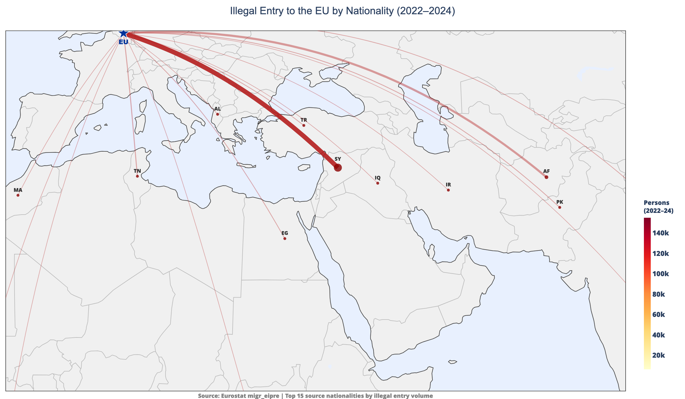
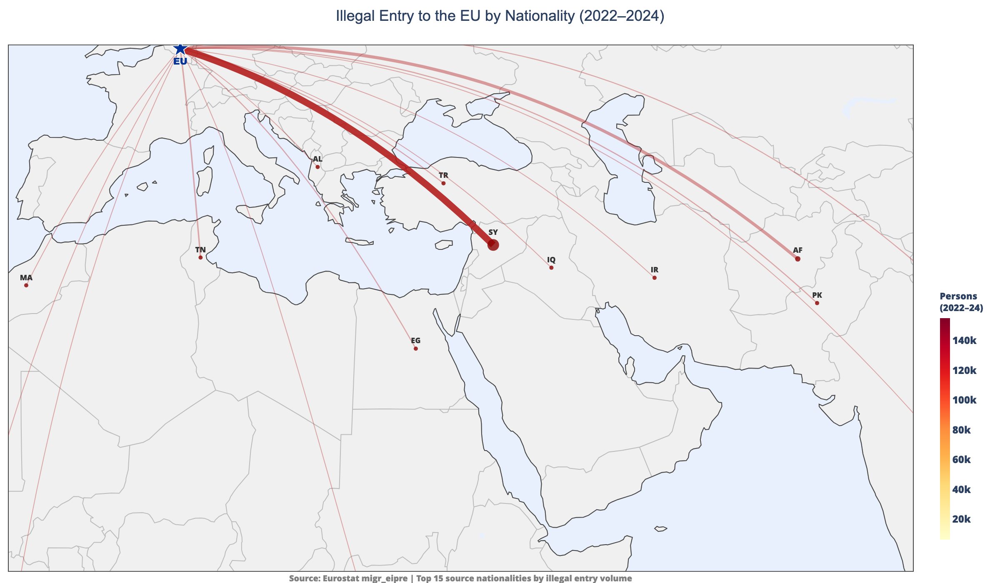

<!-- _class: title -->
<!-- _paginate: false -->
<!-- _footer: '' -->

# Reducing Small Boat Arrivals

Where should the UK focus upstream interventions?

<!-- ~10 sec -->

---

<!-- _class: dark -->

## Recommendation

> Prioritise upstream engagement with **[Country A]**, **[Country B]**, and **[Country C]**.

They are the largest sources of small-boat arrivals, sit on the most active European routes, and have the lowest return rates.

1. **[Country A]** — [one-line rationale]
2. **[Country B]** — [one-line rationale]
3. **[Country C]** — [one-line rationale]

<!-- ~30 sec: Land the punchline immediately — here are the countries, here's why -->

---

## Who is arriving? Top source countries

- **Afghanistan, Iran, Iraq, and Syria** dominate illegal entry to the UK (2018–2025)
- [Headline finding — e.g. "These four nationalities account for X% of all detected arrivals"]

<!-- ~40 sec -->

---

## How do they reach the UK? Routes & transit countries

- **Syria** is the largest source of illegal entry to the EU (2022–24), entering via the **Eastern Mediterranean**
- The same nationalities arriving in the UK first transit through **Turkey** and **Libya**
- [Insight linking EU route patterns to UK small-boat nationalities]

<!-- ~40 sec -->

---

## How are flows changing over time?

- [Trend headline, e.g. "Small boat crossings rose X% in 2024, but the nationality mix is shifting"]
- **[Emerging country]** arrivals have **doubled** since [year], signalling a growing route via **[transit country]**
- [Implication for future priority countries]

<!-- ~40 sec · CHART: line chart — annual illegal entries by top 4-5 nationalities, 2019–2025 -->

---

## The returns gap

- The UK returned **Y people** in [year] — only **Z%** of those who entered illegally
- [Key stat, e.g. "For every 10 arrivals, fewer than 2 are returned"]

<!-- ~40 sec · CHART: paired bar or waterfall — arrivals vs returns by year -->

---

## Where are returns failing?

- The UK struggles most to return nationals of **[Country X]** and **[Country Y]**
- [Headline, e.g. "Enforced return rate for [Country X] is under 5%, despite being a top source country"]
- These are the countries where **returns agreements would have the greatest impact**

<!-- ~40 sec · CHART: scatter or bar — return rate vs volume, highlighting low-rate / high-volume -->

---

<!-- _class: end -->
<!-- _paginate: false -->

# Thank You

Explore the data: [chri4354.github.io/april-repo](https://chri4354.github.io/april-repo/)

Questions?
