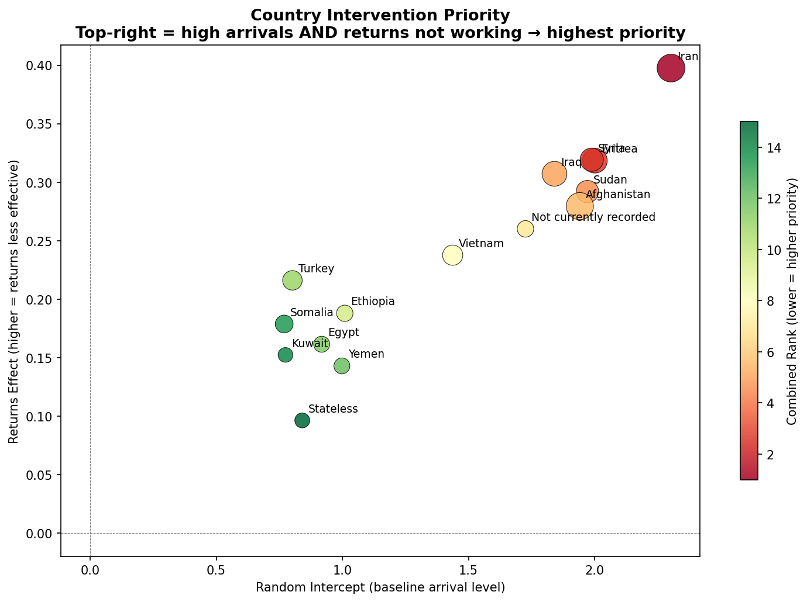
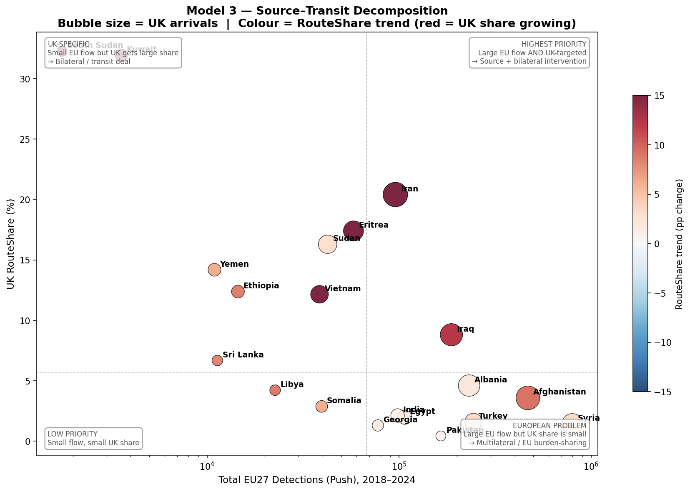
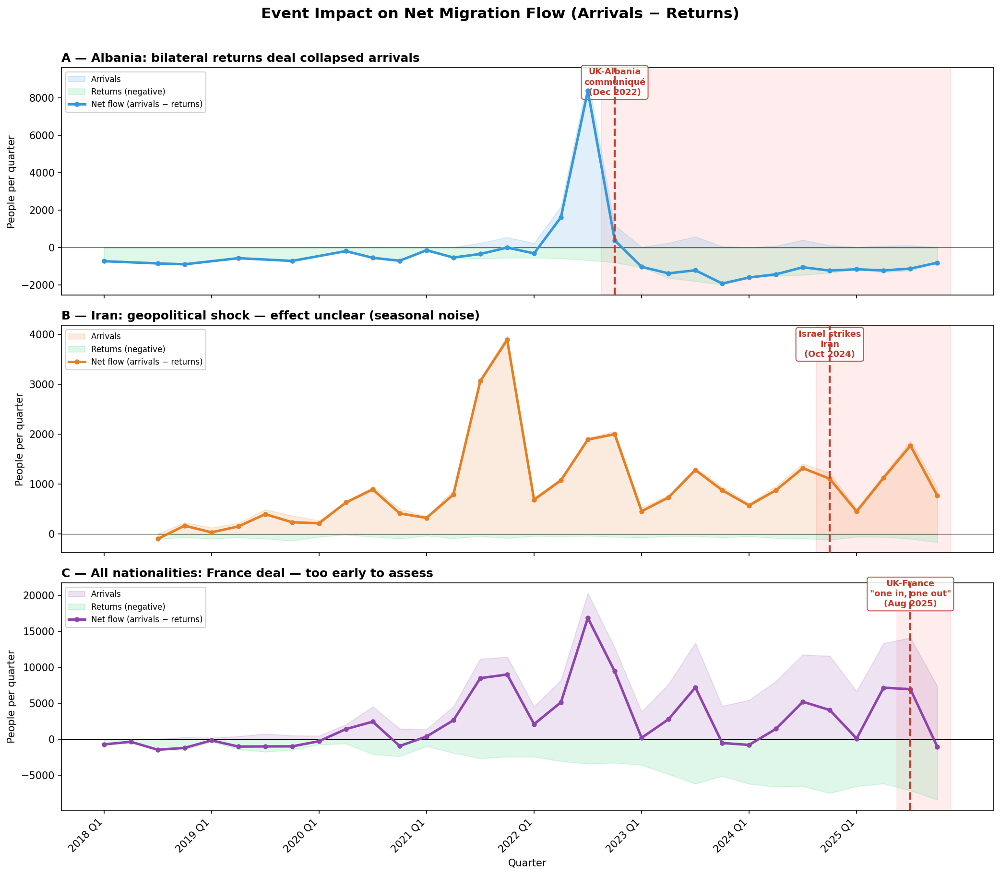
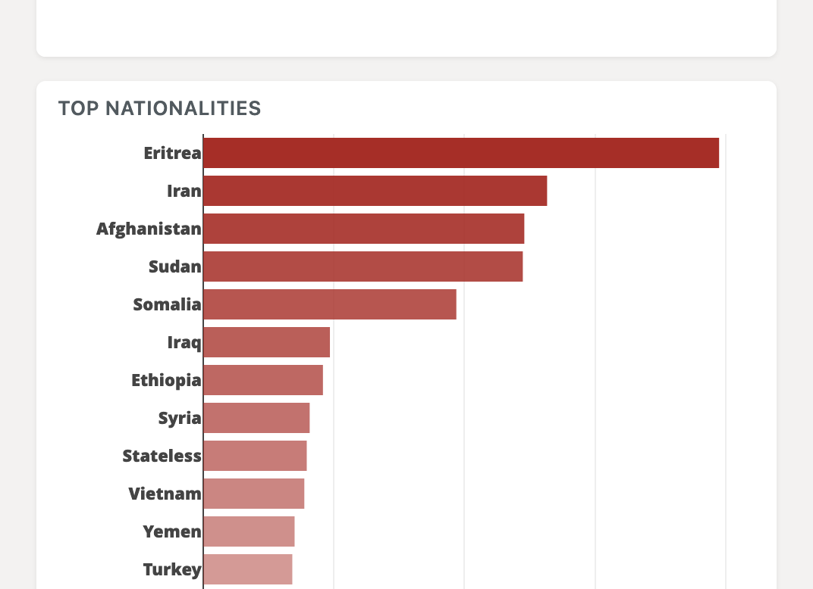
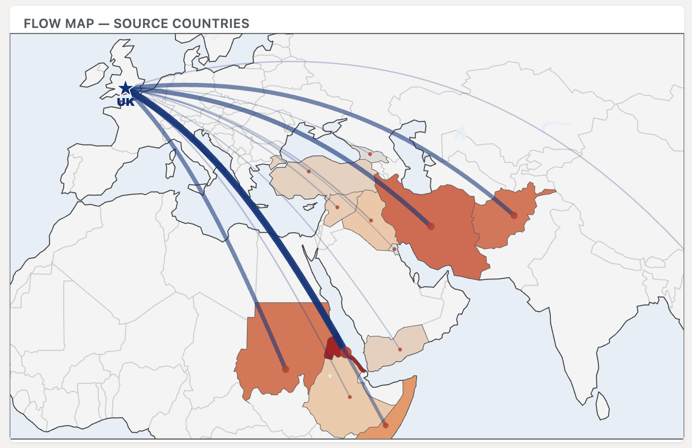
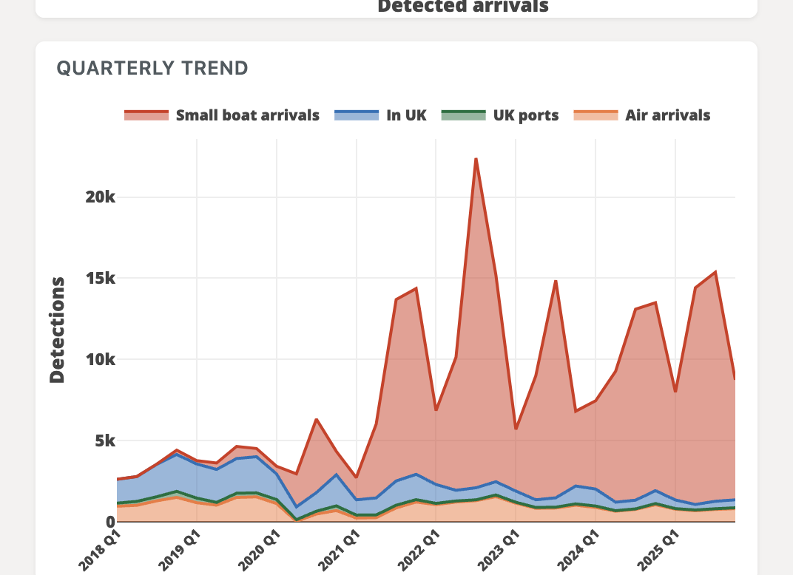
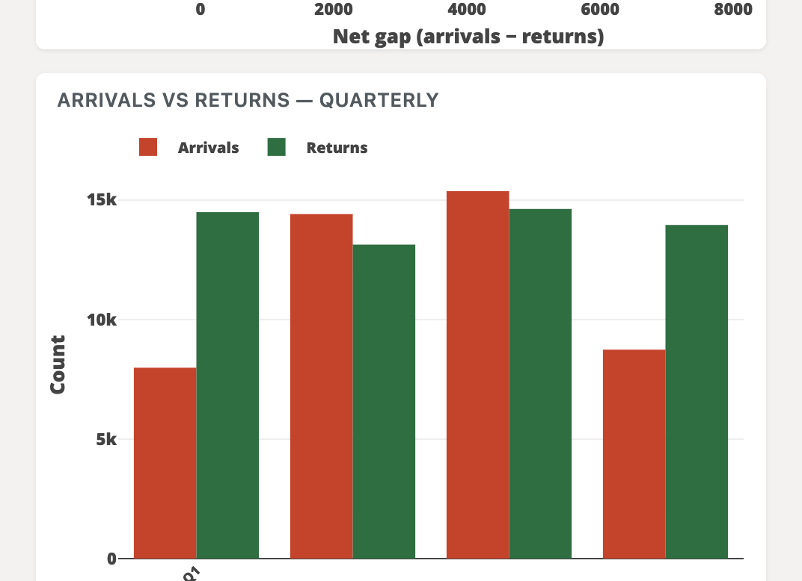
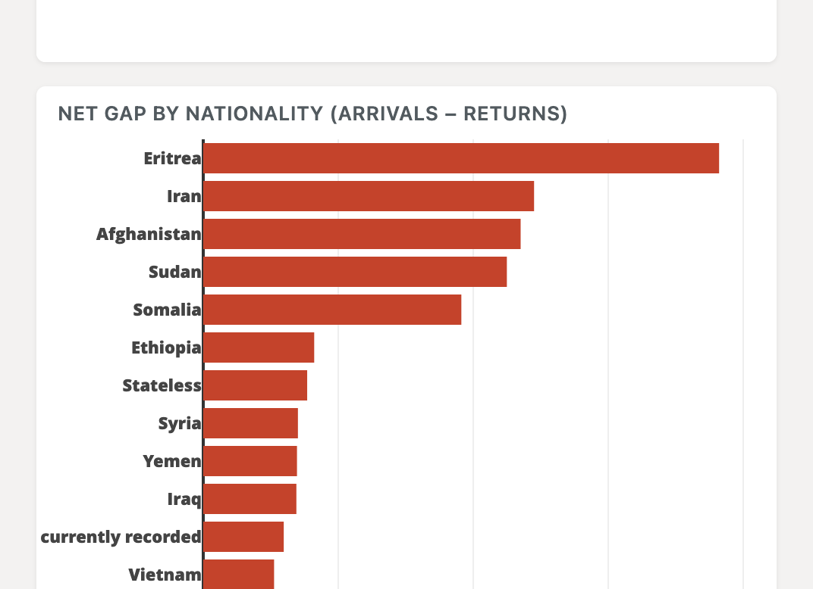
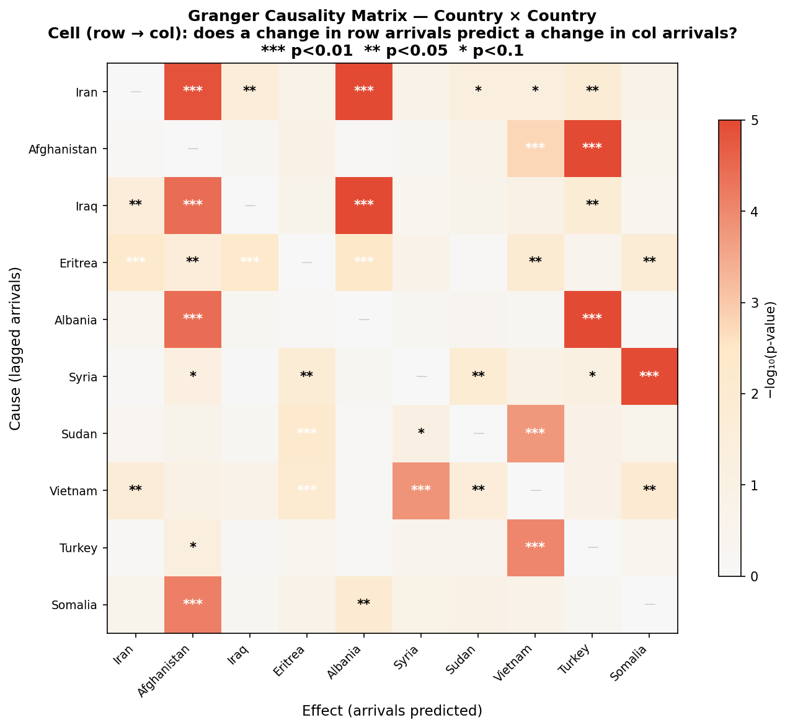

<!-- _class: title -->
<!-- _paginate: false -->
<!-- _footer: '' -->

# Reducing Small Boat Arrivals

Where should the UK focus upstream interventions?

<!-- ~10 sec -->

---

<!-- _class: dark -->

## Recommendation

> Match the **type of intervention** to each country's migration profile.

| Country | EU27 Detections | UK RouteShare | Intervention |
|---|--:|--:|---|
| **Iran** | 95,590 | 20.4% | Source + bilateral deal |
| **Eritrea** | 57,855 | 17.4% | Bilateral / transit deal |
| **Sudan** | 42,430 | 16.3% | Bilateral / transit deal |
| **Vietnam** | 38,495 | 12.2% | Bilateral / transit deal |
| **Afghanistan** | 468,215 | 3.6% | Multilateral / EU burden-sharing |
| **Iraq** | 187,205 | 8.8% | Source + bilateral deal |

Iran, Eritrea, Sudan, and Vietnam **disproportionately target the UK** — bilateral deals directly reduce UK arrivals. Afghanistan and Syria mostly reach other EU states — pursue **multilateral burden-sharing**.

<!-- ~30 sec -->

---

## Which countries should be prioritised?

- **Top-right** = high arrivals AND ineffective returns — highest priority
- **Iran** is the clear #1, followed by Eritrea, Syria, Sudan, and Iraq

<!-- ~40 sec -->

---

## Source vs transit: where should the UK intervene?

Not all countries require the same type of deal. Comparing UK arrivals to **EU-wide flows** reveals whether a nationality is a UK-specific problem or a broader European one.

| Nationality | UK Arrivals | EU27 Detections | UK RouteShare | Intervention |
|---|--:|--:|--:|---|
| **Iran** | 25,780 | 95,590 | **20.4%** | Source + bilateral |
| **Afghanistan** | 22,667 | 468,215 | 3.6% | Multilateral / EU sharing |
| **Iraq** | 17,521 | 187,205 | 8.8% | Source + bilateral |
| **Eritrea** | 11,552 | 57,855 | **17.4%** | Bilateral / transit deal |
| **Sudan** | 8,201 | 42,430 | **16.3%** | Bilateral / transit deal |
| **Vietnam** | 6,996 | 38,495 | **12.2%** | Bilateral / transit deal |

<!-- ~40 sec -->

---

## The policy quadrant

- **Top-right**: large EU flow AND UK-targeted — highest priority
- **Top-left**: small EU flow but high UK share — bilateral or transit deals
- **Bottom-right**: large EU flow but low UK share — multilateral burden-sharing

<!-- ~40 sec -->

---

## What does this mean?

- **Iran, Eritrea, Sudan, Vietnam** have high UK RouteShare (**12–20%**) — these nationalities disproportionately target the UK. Bilateral agreements would directly reduce UK arrivals.
- **Afghanistan and Syria** have very low RouteShare (**<4%**) — the vast majority go to Germany, Sweden, and France. Source-country interventions benefit Europe broadly but the UK captures only a small share of the gain.
- **Vietnam's UK share is growing fastest** (+31pp since 2018), signalling an emerging UK-specific route that warrants urgent attention.

> The UK should pursue **bilateral deals** with Iran, Eritrea, Sudan, and Vietnam, and seek **multilateral burden-sharing** on Afghanistan and Syria.

<!-- ~40 sec -->

---

## Do interventions work? Evidence from real events

- **Albania deal** (Dec 2022): arrivals collapsed from 3,000/qtr to 500; net flow flipped **negative**
- **Israel strikes Iran** (Oct 2024): no clear effect on Iranian migration
- **France "one in, one out"** (Aug 2025): too early to assess — only 2 quarters of data

<!-- ~40 sec -->

---

<!-- _class: dark -->

## Appendix: Exploratory Data Analysis

---

## Who is arriving? Top source countries (2025)

- **Eritrea** has overtaken Iran and Afghanistan as the #1 nationality
- Top four account for **49%** of 46,497 detections

<!-- ~40 sec -->

---

## How do they reach the UK? Routes & transit countries

- Sources cluster in the **Horn of Africa** and **Middle East**, transiting via **Turkey** and **Libya**

<!-- ~40 sec -->

---

## How are flows changing over time?

- Small boats = **89%** of entries; peaked 2022, **rebounded** in 2024–25
- Horn of Africa nationals (Eritrea, Sudan, Somalia) are rising fast

<!-- ~40 sec -->

---

## The returns gap

- In 2025: **56,197** returns vs **46,497** arrivals — net **−9,700**
- But returns are mostly **visa overstayers and FNOs**, not small boat nationalities

<!-- ~40 sec -->

---

## Where are returns failing?

- **Eritrea, Iran, Afghanistan, Sudan** — high arrivals, virtually zero returns
- These are where **returns agreements would have the greatest impact**

<!-- ~40 sec -->

---

## Are countries' migration flows linked?

- Granger causality tests whether a change in arrivals from one country **predicts** a change from another
- Significant links suggest **shared routes or push factors** — intervening in one may affect the other

---

<!-- _class: end -->
<!-- _paginate: false -->

# Thank You

Explore the data: [chri4354.github.io/april-repo](https://chri4354.github.io/april-repo/)

Questions?
